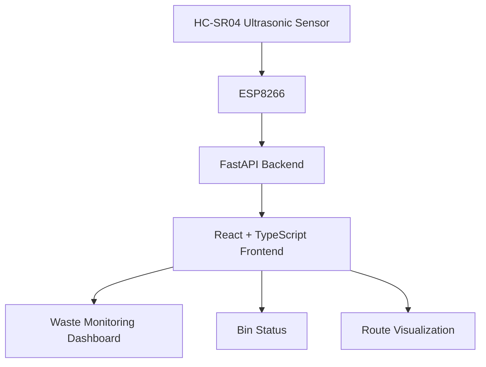
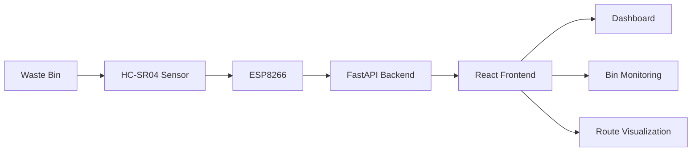
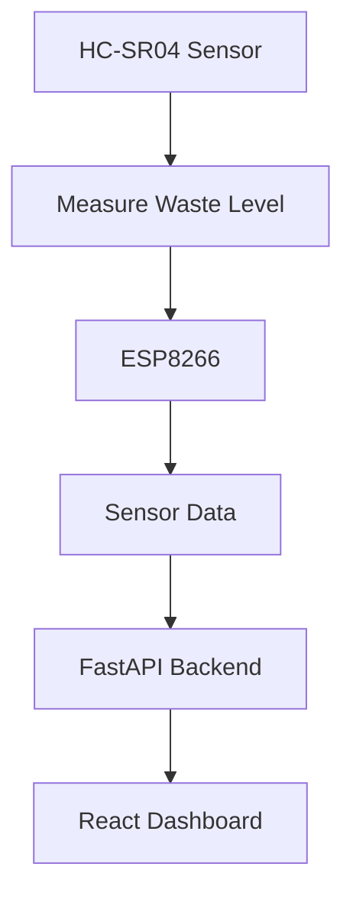
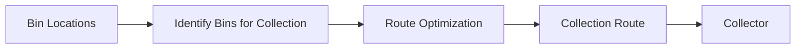
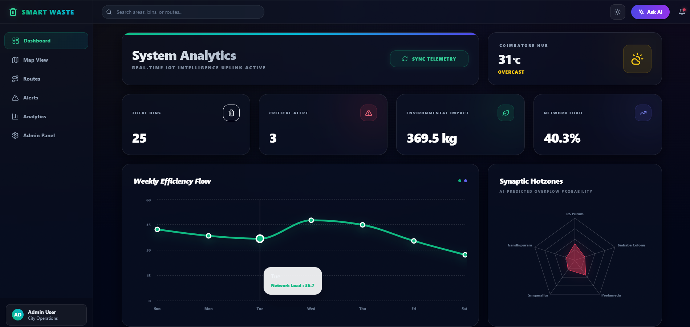
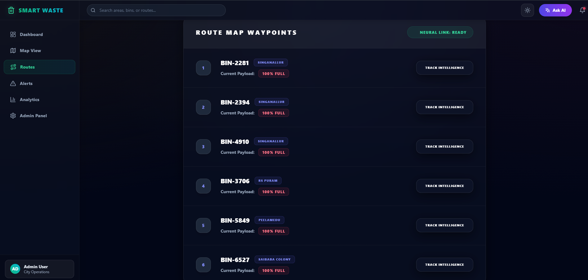

# ♻️ Smart Waste Recycling System

An IoT-based smart waste management system that monitors waste-bin levels, displays bin status, and supports efficient waste collection through route optimization.

## 📌 Overview

The **Smart Waste Recycling System** combines IoT sensors with a web application to monitor waste bins and improve the efficiency of waste collection.

An **HC-SR04 ultrasonic sensor** connected to an **ESP8266** is used to monitor the waste level. The sensor data is processed through a **FastAPI backend** and displayed through a **React and TypeScript frontend**.

## ✨ Features

* 🗑️ Waste-bin level monitoring
* 📊 Bin status visualization
* 🚨 Waste collection alerts
* 📍 Bin location visualization
* 🗺️ Collection route visualization
* 🚛 Route optimization
* 📡 IoT sensor integration
* 💻 Interactive web dashboard

## 🏗️ System Architecture



## 🔄 System Workflow



## 🛠️ Technologies Used

### Frontend

* React.js
* TypeScript

### Backend

* FastAPI
* Python

### IoT

* ESP8266 / NodeMCU
* HC-SR04 Ultrasonic Sensor

### Concepts

* Internet of Things (IoT)
* Route Optimization

## 📡 IoT Integration

The HC-SR04 ultrasonic sensor measures the distance between the sensor and the waste inside the bin.



The ESP8266 collects the sensor readings and communicates the data to the backend, where it can be processed and displayed on the frontend.

## 🗺️ Route Optimization

The system supports route optimization to help waste collectors identify an efficient collection sequence for bins that require attention.



## 👩‍💻 My Contribution

My primary contribution was focused on **frontend development**.

* Developed the frontend using React and TypeScript.
* Designed and implemented the waste-monitoring dashboard.
* Created UI components for displaying bin and waste status.
* Designed user-friendly interfaces for monitoring waste-management activities.
* Implemented visualizations for bin information and collection routes.


## 📁 Project Structure

```text
Smart_waste_recycling/
│
└── mini prj/
    └── ai-smart-dustbin/
        ├── backend/
        │   ├── main.py
        │   └── ...
        │
        └── frontend/
            ├── src/
            ├── public/
            ├── package.json
            └── ...
```

## 🚀 Getting Started

### Prerequisites

Make sure you have the following installed:

* Node.js
* npm
* Python
* Git

### Clone the Repository

```bash
git clone https://github.com/Savitha20-06/Smart_waste_recycling.git
cd Smart_waste_recycling
```

### Backend Setup

```bash
cd "mini prj/ai-smart-dustbin/backend"
```

Create/activate the virtual environment:

```powershell
.\venv\Scripts\activate
```

Start the FastAPI server:

```powershell
uvicorn main:app --reload
```

The backend will run on:

```text
http://127.0.0.1:8000
```

### Frontend Setup

Open a **new terminal** and run:

```powershell
cd "mini prj/ai-smart-dustbin/frontend"
npm install
npm run dev
```

The frontend will run on:

```text
http://localhost:5173
```

Open the dashboard in your browser:

**http://localhost:5173**

### Dashboard



### Waste Monitoring





### Route Visualization


## 🎯 Project Goal

The goal of this project is to improve waste collection efficiency by combining **IoT-based waste monitoring, web development, and route optimization** into a single smart waste-management system.

## 🔮 Future Enhancements

* Real-time IoT data transmission
* Mobile application for waste collectors
* AI-based waste-level prediction
* Automatic waste classification
* Advanced route optimization
* Historical waste analytics
* Real-time notifications

## 📌 Project Information

**Project Type:** Academic Project
**Domain:** IoT + Web Development + Smart Waste Management

## 📄 License

This project is developed for academic and educational purposes.
